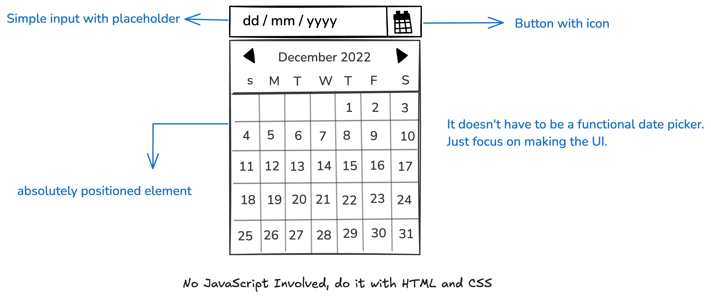

# Datepicker UI

## Overview
This project focuses on building a clean and visually structured datepicker user interface using only HTML and CSS.

The component is intentionally static (non-functional) and is designed to serve as a foundational UI element that can later be enhanced with JavaScript for full interactivity.

## Objective
The primary goal of this project is to strengthen core frontend skills, specifically:
- CSS positioning techniques
- Layout structuring (Flexbox, Grid)
- Visual styling and component design

## Preview
Below is a reference mockup of the expected datepicker layout:

## Customization
You are encouraged to personalize the design by modifying:
- Color schemes
- Typography
- Spacing and alignment
- Overall visual style

## Scope
- Static UI only (no JavaScript functionality)
- Focus on design accuracy and clean structure
- Maintain semantic and well-organized HTML

## Future Improvements
This UI can be extended into a fully functional datepicker by integrating JavaScript features such as:
- Date selection
- Month/year navigation
- Dynamic rendering

## Conclusion
This project provides a practical foundation for building reusable UI components and prepares you for developing interactive frontend features in future applications.